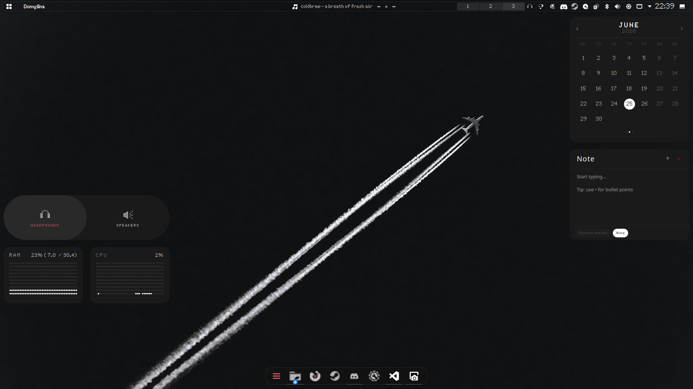

# poor-nothing-kde-widgets
Just some widgets that quickly ClaudeAI made inspired by NothingOS widgets.

## These widgets would not be possible without [jaxparrow07 nothing kde widgets](https://github.com/jaxparrow07/nothing-kde-widgets)!

## List of widgets
1. **nothing-ram-widget**
Shows Ram usage
2. **nothing-cpu-widget**
Shows cpu usage
3. **nothing-calendar-widget**
Basic calendar
4. **nothing-audio-widget**
Changes audio input on click. Available config.
5. **nothing-notes-widget**
Basic sticky notes function.

### How does it look

**It was entirely made via Claude. It was made in a rush so there are some issues for sure.**
